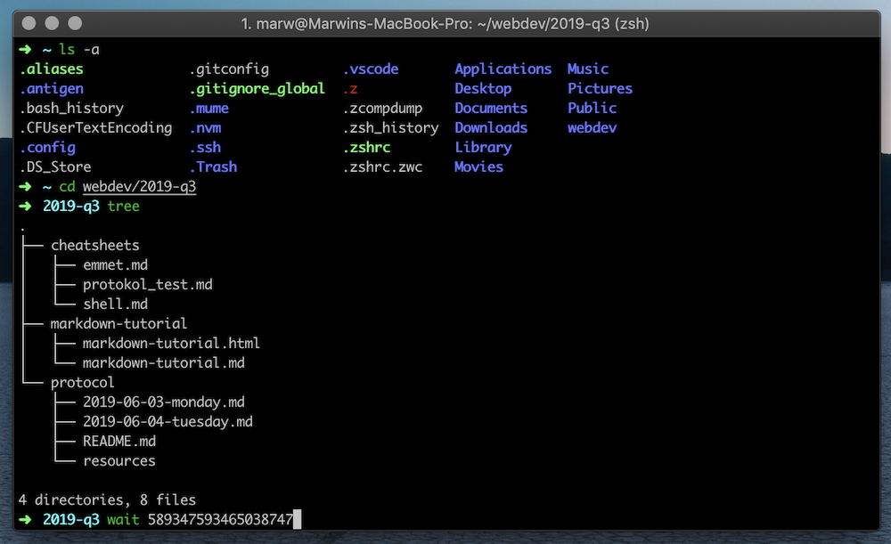

 04.06.2019, Montag

## **Git/GitHub, Shell Commands & Markdown**

### Git & GitHub Begriffe

Git ist ein System zur Versionskontrolle. Es wurde entwickelt um Versionen von Textdateien (i.e. code) abzutimmen und Kollaboration effizienter und einfacher zu gestalten.

#### Die wesentlichen Schritte
*Git - Versionskontrolle*
1. **init:** *Projekt initialisieren.* Es wird ein unsichtbarer Ordner angelegt (.git) in dem sich alle Informationen über Änderungen an Dateien befinden

2. **stage:** *Sammeln der Änderungen.* Änderungen an Dateien werden nicht automatisch übernommen. Vor dem synchroniesieren wird manuell eine Auswahl der zu synchronisierenden Dateien getroffen *(stage changes)*.
3. **commit** *Synchronisieren.* Um die gesammelten Dateien von der stage mit der git-Historie zu synchronisieren muss ein commit gemacht werden. Es ist üblich mit jedem commit eine kurze und präzise Nachricht zu hinterlassen in der beschrieben wird was durch den jeweiligen commit hinzugefügt wird

*GitHub - Hoster und Kollaboration (local & remote)*

4. **master & branch** *Kollaboration.* Der Stamm (master), welcher später aus dem fertigen Projekt besteht, kann auch Abzweigungen haben (branch). Der *master* sollte fertiggestellte bzw. funktionierende code-Abschnitte beinhalten, also eine stabile Version. *Branches* dienen dazu die Kollaboration zu erleichtern, aber auch die Arbeit an neuen oder experimentellen Ideen und Features sicher zu stellen.

5. **merge** *Zusammenlegen.* Wenn ein branch bereit ist Teil der stabilen Version zu werden wird ein merge initiiert um den code zusammen zu legen.

 
*Quelle: blog.red-badger.com/2016/11/29/gitgithub-in-plain-english*

#### Kernbegriffe
- **Repository:** Das Verzeichnis in dem sich alle Dateien des Projektes befinden
- **Local:** auf einem Laptop oder Desktop Computer (offline)
- **Remote:** Online bzw. auf einem Server "in der cloud"
- **Pull Request:** a Github tool that allows users to easily see the changes (the difference or “diff”) that a feature branch is proposing as well as discuss any tweaks that said branch might require before it is merged into master   
- **Stage:** Sammlung der Änderungen *vor* dem commit
- **Commit:** Synchronisieren der Änderungen mit dem master/branch
- **Master:** Stabiler Stamm des Projektes
- **Branch:** Die Baustelle. Neue, unfertige, work in progress, experimentelle Features & Ideen
- **Collab:** Kollaboration zwischen mehreren Menschen (oder K.I.?)
- **Merge:** Zusammenlegen von branch und master. Änderungen und ergänzungen werden besprochen und kontrolliert vereint

### Die Shell
 
Die *shell* oder auch *command line* (Command Promt auf Windows, Terminal auf macOS) ist eine Textkonsole die benutzt wird um mit dem Betriebssystem zu kommunizieren. Im Vergleich zu der Grafischen Oberfläche (wie z.B Finder oder Explorer) scheint dieses Werkzeug zunächst kompliziert und umständlich, kann aber mit dem 

### Cheat Sheet für **Shell Befehle**

### Wechseln zu anderen Ordnern / Inhalt anzeigen etc.:
**Befehl** | **Effekt**
------ | ------
`cd [Ordnername]` | change directory
 `..` | Weiterleitung in übergeordnete Ordner
 `z neu` = `cd ~/neuefische` | z lernt oft benutzte Ordner und bietet so Abkürzung
 `ls` | Liste aller Dateien und Unterordner eines Ordners
 `ls -la` | Liste mit Details `l` (=long; untereinander auflisten) und durch `a` (=all) werden auch versteckte Dateien angezeigt
 `tree` | Verzeichnisbaum anzeigen
 `curl` | lädt Objekt über eine URL
 `cat` | zeigt den Inhalt einer Datei

### Neu, verschieben, kopieren, löschen, öffnen:

**Befehl** | **Effekt**
------ | ------
 `mkdir` | Ordner erstellen
 `mkdir [Ordner/Unterordner]` | Unterordner erstellen
 `mkdir -p [Ordner/Unterordner/Unterunterordner/...]` | Ordnerpfad wird erzeugt
 `touch [Dateiname]` | Datei erstellen
 `mv [alter Name] [neuer Name]` | Ordner/Datei umbenennen
 `mv [alter Pfad] [neuer Pfad]` | Ordner/Datei verschieben
 `mv [Ordner] *` | verschieben des Ordners in den aktuellen Ordner
 `cp -R [src-directory] [target-directory]` | kopiert alles aus dem Quellverzeichnis in das Zielverzeichnis
 `pbcopy` | speichert Eingabe in die Zwischenablage (Bsp.: `cat ~/.ssh/id_rsa.pub | pbcopy`)
 `rm` | remove (geht nur bei Dateien)
 `rm -rf` | Ordner löschen; `r` = rekursiv (alles in allen Unterordnern); `f` = force (nicht jede Datei einzeln bestätigen); auch *Rimraf* genannt
 `rm -rf *` | löschen aller Ordner und Dateien im aktuellen Ordner
 `code .` | aktueller Ordner wird bei VS Code aufgerufen
 `open [Datei]` | öffnet Datei mit dem Standardprogramm eines Betriebssystems
 `open .` | öffnet Ordner im Finder/Explorer

